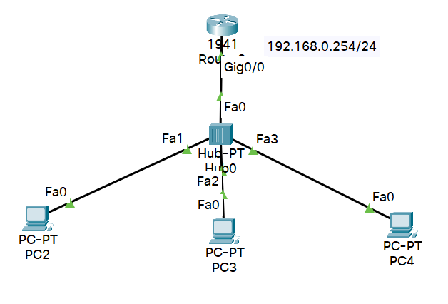

# ネットワークハンズオン

- スライドなし
- Cisco Packet Tracerを利用

---

## 概要
- IPアドレス
- サブネットマスク
- スタチックルーティング
- ダイナミックルーティング（RIP）
- DHCP
- VLAN
 
 

## 作成したネットワーク
---
### スタティックルーティングとダイナミックルーティンの演習で利用

### DHCPの演習で利用

### ポートVLANの演習で利用

### タグVLANの演習で利用

 
 

## VLANの補足説明
---
- VLANは，ネットワークを倫理的に分割することができる．
- VLANには，**ポートVLAN**と**タグVLAN**がある．
- VLANを設定する際には，アクセスリンクとトランクリンクがある．
- ポートVLANでは，アクセスリンクのみを使う．
- タグVLANでは，アクセスリンクとトランクリンクを使う
